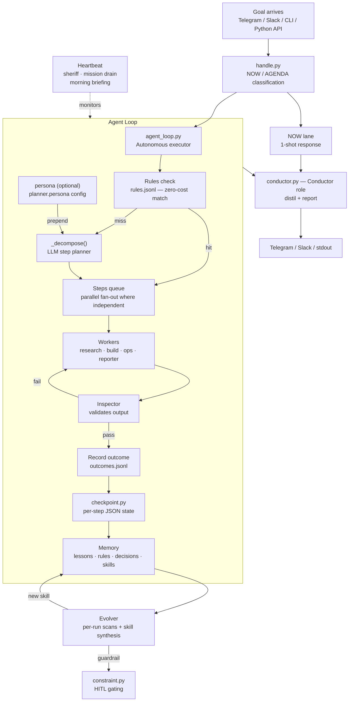

# Maro

> Named for Publius Vergilius **Maro** — the poet Virgil, who in Dante's *Inferno* guides the traveler down through the dark and safely out the other side. Maro does the same for autonomous agents: hand it a goal and it finds the path through — decompose, execute, recover, report.

Autonomous agent framework that holds its agents accountable. Give it a goal; it decomposes, executes, and reports — then verifies whether the goal was actually achieved, not just whether the loop finished.

Works standalone or alongside OpenClaw, Telegram, Slack, or any other interface you wire in.

> **Not Microsoft's MARO:** if you're looking for `pymaro` — Microsoft's reinforcement-learning platform for resource optimization (container logistics, bike-share rebalancing, data-center capacity) — that's [github.com/microsoft/maro](https://github.com/microsoft/maro). This repository is **maro-orchestration**: hand a goal to a team of AI agents and get back work that's been verified as actually done, not just run to completion.

> **Status: personal infrastructure / active development.** This is a working system, not a polished library. APIs change, features are added fast, and some things are still sharp edges. It runs continuously on a headless Ubuntu box and gets iterated on daily. If you're reading this and it seems useful, it probably is — just go in eyes open.

### Prerequisites

- **Python 3.10+** (tested on 3.12–3.14)
- **Linux or macOS** (Linux preferred for always-on deployments)
- One LLM lane: an API key (`ANTHROPIC_API_KEY`, `OPENROUTER_API_KEY`, or
  `OPENAI_API_KEY`) **or** the `claude` CLI (Claude Code OAuth — no key
  needed). The `claude` CLI lane is the most-tested path (it's what Maro's
  own box runs); any supported lane should work. If you use a
  subscription-backed CLI as a programmatic backend, check your plan's
  terms of service — that's between you and your provider.
- Optional: `gh` CLI (GitHub), Telegram bot token

---

## What it does

- **Autonomous loops**: goal → plan → execute steps → done|stuck, with stuck detection, roadblock recovery, and progress logging
- **Multi-agent delegation**: Director plans, Workers execute (research / build / ops), Inspector validates — no Worker grades its own output
- **Persistent memory**: lessons extracted from every run, injected into future prompts; tiered decay (short/medium/long); spaced repetition
- **Learning pipeline**: skills synthesized and promoted at run finalization; per-run statistical scans record improvement suggestions — see [Memory and self-improvement](#memory-and-self-improvement) for exactly what fires today vs what's still experimental
- **Skill library**: reusable step patterns extracted from successful runs; scored, tested, and promoted automatically
- **Interface-agnostic**: Telegram, Slack, CLI, or call `run_agent_loop()` directly from Python — same behavior regardless of how a goal arrives
- **Token-efficient research**: pre-fetch layer intercepts URLs before LLM calls, uses Jina Reader for clean markdown, authenticated X/Twitter access via CLI
- **Cost reporting**: summarize `memory/step-costs.jsonl` into grouped latency/token/cost tables instead of eyeballing raw JSONL

**What that looks like in practice** — real asks, one sentence in, one answer out:

> "Where can I get non-ethanol gas in or around Manti, Utah?" → orchestrated multi-source research → named stations with sources, in minutes
> "Summarize this repo's commits since the last tag into an operator digest." → digest artifact (and the reusable skill it crystallized into)
> "Watch this feed and tell me when [condition]." → standing heartbeat check, silent until it fires

The growing catalog of example goals — simple through complex, each marked verified/target/aspirational — lives in [docs/CAPABILITIES.md](docs/CAPABILITIES.md). It doubles as the test corpus and the target for the pre-installed skill set.

---

## What makes it different

Most of the list above is table stakes in 2026. Maro's distinguishing layer is accountability: "done" is treated as a claim to verify, not a status to trust.

- **done ≠ achieved** — every run carries a `goal_achieved` verdict separate from loop completion; a run that finished without meeting the goal is demoted to `incomplete` and classified `done-not-achieved` on its run card (`handle.py`, `run_curation.py`)
- **Fabrication detection** — a zero-LLM before/after filesystem diff flags steps that claim writes that never landed (`artifact_check.py`); file paths and Python symbols named in step results are existence-checked (`claim_verifier.py`)
- **Grounded adversarial review** — a reviewer contesting a result must supply a read-only shell command that settles the contestation; we run it, so the verdict is mechanical rather than a second LLM opinion (`claim_probe.py`)
- **Fail-closed spend caps** — $5/run and $25/day on by default; a malformed budget value falls back to the default cap, never to uncapped (`loop_init.py`)
- **Write fence** — an out-of-fence write demotes a "done" step to blocked, with the offending paths logged as evidence (`loop_execute.py`)
- **Replay capture** — every LLM call's prompt, response, and tool events are written secret-scrubbed to `<run-dir>/build/calls/`; local, free, on by default (`MARO_RECORD=0` to disable) (`runs.py`)
- **Free-first validation** — hosted free-tier models (gemini-flash-lite/groq via `hosted_free.py`) act as the first-pass step judge after a deterministic Tier-0 check, escalating to a paid model only when uncertain or verdict-less (`step_exec.py`; local-model rung removed 2026-07-21, revival path in `docs/LOCAL_VALIDATOR.md`)
- **Portable learning** — `maro-import` merges runs and memory ledgers from another workspace with provenance markers and exact-line dedup under lock; curated files are quarantined for review, never merged into live state (`workspace_import.py`)
- **No phone-home** — no network telemetry of any kind; all metrics stay in local JSONL

---

## Architecture



### LLM backends (`llm.py`)

All share one interface: `LLMAdapter.complete(messages, tools) → LLMResponse`

| Backend | When active |
|---------|-------------|
| `AnthropicSDKAdapter` | `ANTHROPIC_API_KEY` set |
| `ClaudeSubprocessAdapter` | `claude` binary in PATH (Claude Code OAuth) |
| `OpenRouterAdapter` | `OPENROUTER_API_KEY` set |
| `OpenAIAdapter` | `OPENAI_API_KEY` set |
| `CodexCLIAdapter` | `codex` binary available (ChatGPT OAuth) |

`build_adapter("auto")` walks `model.backend_order` from config (default:
anthropic → subprocess → openrouter → openai) and fails over across the
available backends at runtime. `maro-doctor` reports exactly which backends a
run would find, using the same detection. `MODEL_CHEAP/MID/POWER` abstract
model names across backends.

Note on the CLI-backed lanes (`claude` / `codex` subprocess adapters): they
run under **your own subscription and judgment** — review your provider's
usage policies for automated/headless use before pointing unattended
workloads at them.

---

## Quickstart

> On PyPI the package is `maro-orchestration` (`pip install maro-orchestration`) —
> see the name note above.

```bash
# 1. Clone and install
git clone https://github.com/slycrel/maro-orchestration.git
cd maro-orchestration
pip install .          # or `pip install -e ".[dev]"` for development

# 2. Give it an LLM lane — an API key, or nothing if you have Claude Code
export ANTHROPIC_API_KEY=sk-ant-...
# or: export OPENROUTER_API_KEY=... / export OPENAI_API_KEY=...
# or: skip this — an installed `claude` CLI works as the backend on its own
#     (most-tested lane; subscription CLIs as backends: check your plan's terms)

# 3. Bootstrap: workspace dirs, a commented starter ~/.maro/config.yml,
#    service templates, and a smoke test
maro-bootstrap install

# 4. Check the install — every row tells you what to fix if it fails
maro-doctor

# 5. Run your first goal
maro-handle "what time is it in Tokyo?"          # quick answer (NOW lane)
maro-handle "research the top 3 LLM frameworks"  # multi-step (AGENDA lane)

# Or use the autonomous loop directly
maro-run "research winning polymarket strategies"
```

No OpenClaw installation required. Set `MARO_WORKSPACE` to any directory to
use a custom workspace root.

**Safe by default:** fresh installs are spend-capped at **$5/run and $25/day**
(`budget.per_run_usd` / `budget.daily_usd` — raise them in `~/.maro/config.yml`,
or set `0` to explicitly uncap), and workers are write-fenced to the run's
project directory plus paths the goal names (`validate.write_fence`). The
seeded config documents every knob; the full registry is
[docs/DEFAULTS.md](docs/DEFAULTS.md).

### More commands

```bash
# Telegram listener (requires TELEGRAM_BOT_TOKEN)
python3 src/telegram_listener.py           # run forever
python3 src/telegram_listener.py --once    # process pending and exit

# System health
python3 src/cli.py sheriff health
maro-observe

# Dedicated autonomous build-loop runner
python3 src/cli.py build-loop --worker-session handle --format json
./scripts/build-loop.sh --worker-session handle --format json

# Example cron target (every 5 minutes)
*/5 * * * * cd /path/to/maro-orchestration && MARO_WORKSPACE=/path/to/workspace ./scripts/build-loop.sh --worker-session handle --format json >> /tmp/maro-build-loop.log 2>&1

# Memory status
python3 src/cli.py outcomes context
python3 src/cli.py memory status
```

### Logging

Structured logging via stdlib `logging`. All loggers live under the `maro.*` namespace.

```bash
# Quiet (default) — only warnings and errors
python3 src/agent_loop.py "your goal"

# Step lifecycle, timing, tokens, block reasons
MARO_LOG_LEVEL=INFO python3 src/agent_loop.py "your goal"

# Full detail — constraint checks, adapter type, content lengths
MARO_LOG_LEVEL=DEBUG python3 src/agent_loop.py "your goal"
```

The `--verbose` CLI flag is equivalent to `MARO_LOG_LEVEL=DEBUG`. Output goes to stderr so it doesn't interfere with result output.

### Benchmarking and cost reporting

```bash
# Summarize step telemetry
maro-tool-costs --metrics memory/step-costs.jsonl

# Write markdown + JSON reports
maro-tool-costs \
  --metrics memory/step-costs.jsonl \
  --write-report output/benchmarks/tool-cost-report-live.md \
  --write-json output/benchmarks/tool-cost-report-live.json

# Run fixture benchmarks
maro-tool-costs --run-fixtures --fixtures benchmarks/fixture-workloads.json --output-dir output/benchmarks

# Backend benchmarks (memory append/read, filtered lookup, concurrent contention)
maro-benchmark --slice memory-backend --output-dir output/benchmarks
maro-benchmark --slice memory-backend-filtered-lookup --output-dir output/benchmarks
maro-benchmark --slice memory-backend-append-contention --output-dir output/benchmarks --workers 2 4
```

Reports include: task class grouping, ok/error split, median/p95 latency and tokens, total cost, and contention analysis.

| Logger | What it covers |
|--------|---------------|
| `maro.loop` | Step start/done/blocked, adapter timing, USD cost per step, loop lifecycle |
| `maro.planner` | Multi-plan decomposition, dependency graph, execution levels |
| `maro.persona` | Persona spawn, adapter resolution, spawn completion |
| `maro.evolver` | Per-run scans, skill synthesis, suggestion lifecycle |
| `maro.introspect` | Failure diagnosis, lens analysis, recovery planning |

---

## Interfaces

### Telegram

Telegram is optional infrastructure. Manual CLI and mission runs do not require a listener.

Run it directly when you want chat ingress:

```bash
python3 src/telegram_listener.py
```

If you intentionally want a 24/7 listener, supervise that command with your
host's own tooling (a systemd unit you write, launchd, tmux, whatever already
runs things on your box). Maro deliberately doesn't install or generate
service units — see [Optional Services](#optional-services).

Slash commands:

| Command | What it does |
|---------|-------------|
| `/status` | System health, heartbeat, stuck projects |
| `/research <goal or URL>` | Autonomous research loop with live step progress |
| `/director <directive>` | Full Director/Worker pipeline |
| `/build <goal>` | Build worker |
| `/ops <command>` | Ops worker |
| `/map` | Goal relationship map |
| `/ancestry <project>` | Goal ancestry chain |
| `/stop` | Stop running loop |
| `/help` | Command list |

Natural language is auto-routed (NOW = fast, AGENDA = multi-step loop). Messages during an active loop are routed as interrupts.

### Slack

Mirror of the Telegram interface using Socket Mode (no public endpoint):

```bash
pip install slack-sdk
export SLACK_BOT_TOKEN=xoxb-... SLACK_APP_TOKEN=xapp-...
python3 src/slack_listener.py
```

### Python API

```python
from agent_loop import run_agent_loop

result = run_agent_loop(
    "research the three main benefits of prediction markets",
    project="polymarket-research",
    step_callback=lambda n, text, summary, status: print(f"step {n}: {summary}"),
)
print(result.summary())
```

---

## Optional Services

Manual CLI / mission runs need none of these. Maro is an app, not a daemon:
it never installs a systemd unit, launchd agent, or cron entry of its own —
it ships one-shot entrypoints and *you* wire them to whatever already
schedules things on your host. (`maro-bootstrap services` prints
ready-to-paste hook instructions for your platform.)

```bash
# Heartbeat: health check + tiered recovery. Fires ONE beat, then exits —
# hook it to your scheduler, e.g. cron every 30 minutes:
#   */30 * * * * maro heartbeat >> ~/.maro/workspace/logs/heartbeat.log 2>&1
maro heartbeat            # (flags: --dry-run, --no-escalate)

# Telegram: always-on chat ingress — a long-running process you supervise
# with your own tooling (your systemd unit, launchd, tmux, ...):
python3 src/telegram_listener.py

# Inspector: quality-gate review pass over recent runs:
python3 src/cli.py inspector          # one pass, then exits
```

Heartbeat recovery tiers:
1. **Scripted**: disk warn, API key missing, gateway down → log suggestion
2. **LLM diagnosis**: stuck projects → cheap LLM recovery action
3. **Telegram escalation**: critical health → alert the operator

Every escalation-class event (`escalation`, `backend_actionable`,
`stranded_run`) also lands in `~/.maro/workspace/output/escalations.jsonl`
unconditionally — a durable, findable file that exists whether or not a
`notify.command` push lane is configured, and independent of whether that
lane succeeds. A headless/CLI-only setup with no chat integration wired up
still has somewhere to look; `maro-doctor` reports both the file surface
(verifying it's actually writable, not just present — a filesystem-level
write failure is the one way this file can miss an event) and whether a
push lane is also live (see `docs/SUBSTRATE_INTEGRATION.md`).

Autonomous background work (the heartbeat picking up backlog work, not just
health checks) is off by default and applies to loop mode:

```bash
maro heartbeat --loop --autonomy    # long-running; supervise it yourself
```

Without the flag, loop-mode autonomy defers to `heartbeat.autonomy` config
(default off). Use `--no-autonomy` to force health-only mode regardless of
config.

---

## Configuration

Credentials are read in priority order:
1. Environment variables: `ANTHROPIC_API_KEY`, `OPENROUTER_API_KEY`, `OPENAI_API_KEY`, `TELEGRAM_BOT_TOKEN`
2. `$MARO_ENV_FILE` or `<workspace>/secrets/.env`
3. `~/.openclaw/openclaw.json` (OpenClaw config, if present)

Workspace root resolves as: `MARO_WORKSPACE` → `OPENCLAW_WORKSPACE` → `WORKSPACE_ROOT` → `~/.maro/workspace`

OpenClaw is fully optional. The system runs standalone on any machine with Python 3.10+ and a Claude/OpenAI API key.

### Workspace layout

The workspace (`~/.maro/workspace/` by default) holds all runtime state, learning data, and self-evolved artifacts. It is **not** checked into git — the repo ships defaults, and the workspace accumulates improvements over time.

```
~/.maro/workspace/
├── memory/           # Outcomes, lessons, knowledge nodes, captain's log, diagnoses
├── skills/           # Self-created/evolved skill .md files (override repo defaults)
├── personas/         # Self-created/evolved persona specs (override repo defaults)
├── playbook.md       # Director's operational wisdom (appended when evolver suggestions are applied)
├── output/           # Run artifacts, operator status, research outputs
├── projects/         # Per-project NEXT.md, decisions, risks
├── user/             # YOUR GOALS.md / CONTEXT.md / SIGNALS.md (override the repo's neutral templates)
├── config.yml        # Workspace-level config overrides
└── secrets/
    └── .env          # API keys (auto-discovered by config.py)
```

**Resolution order** for skills, personas, and `user/` docs: workspace → repo. When the system evolves a better version of a shipped skill or persona, the workspace version wins. Repo versions are the shipped defaults.

**Personal context (`user/` lane):** the planner injects `user/GOALS.md`, `CONTEXT.md`, and `SIGNALS.md` into every goal-decomposition prompt, and the evolver reads `SIGNALS.md` when proposing sub-missions. The repo ships neutral commented templates — put your real files in `~/.maro/workspace/user/` (the overlay wins; whatever you write there is sent to your model provider). `user/CONFIG.md` is a separate flat `key: value` run-defaults lane (`yolo`, model tiers, MCP servers). Full documentation: [user/README.md](user/README.md).

Two-tier YAML config (like git's `~/.gitconfig` vs `.git/config`):

| File | Scope | What goes here |
|------|-------|---------------|
| `~/.maro/config.yml` | User-level | Model prefs, spend caps, notifications (API keys stay in the environment or `secrets/.env`, never here) |
| `~/.maro/workspace/config.yml` | Workspace-level | Evolver, inspector thresholds, constraint settings |

`maro-bootstrap install` seeds the user file with a fully-commented template
stating the real defaults — uncomment to override. Never overwritten once it
exists. Every key's default and effect: [docs/DEFAULTS.md](docs/DEFAULTS.md)
(census-enforced against the code).

Workspace inherits from user; workspace keys override. Access in code: `from config import get; get("inspector.breach_threshold", 0.30)`

---

## Source modules

| Module | What it does |
|--------|-------------|
| `agent_loop.py` | Autonomous loop: decompose goal → execute steps → done\|stuck |
| `llm.py` | Platform-agnostic LLM adapters (Anthropic, OpenRouter, OpenAI, subprocess, Codex) |
| `web_fetch.py` | URL pre-fetch: Jina Reader clean markdown, X/Twitter auth, t.co resolution |
| `memory.py` | Outcome recording, lesson extraction, tiered decay, Reflexion injection |
| `skills.py` | Reusable step patterns: extract, score, test-gate, promote |
| `persona.py` | Composable agent identities (researcher, builder, ops, companion, psyche-researcher) |
| `hooks.py` | Pluggable callbacks at step/loop/mission level |
| `conductor.py` | Conductor role: distill active missions → executive summary |
| `handle.py` | Entry point: classify intent → route → execute → respond |
| `telegram_listener.py` | Optional Telegram polling, slash commands, ack+edit UX, live step progress |
| `slack_listener.py` | Slack Socket Mode, mirrors Telegram commands |
| `director.py` | Director: plan → delegate to workers → review output |
| `workers.py` | Worker agents: research, build, ops, general |
| `sheriff.py` | Loop Sheriff: detect stuck loops, system health checks |
| `heartbeat.py` | Optional health monitor; autonomy and background drains are opt-in |
| `evolver.py` | Per-run statistical scans + skill synthesis; heartbeat meta-cycle (experimental) |
| `inspector.py` | Quality agent: friction detection, alignment scoring, evolver feed |
| `mission.py` | Mission hierarchy: Mission → Milestone → Feature → Worker Session |
| `ancestry.py` | Goal ancestry chain: parent_id, ancestry.json, prompt injection |
| `metrics.py` | Success rate, cost, token usage per task type; pass@k / pass^k |
| `constraint.py` | Pre-execution action validator: 5 pattern groups (destructive/secret/path/network/exec), HIGH blocks, MEDIUM warns, pluggable registry |
| `security.py` | Prompt injection detection on external content (pre-loop scanning) |
| `config.py` | Workspace resolution, credential discovery, env var priority |
| `bootstrap.py` | `maro-bootstrap install`: dirs, services, smoke test |
| `orch.py` | Core file-first state: NEXT.md tasks, run records, project lifecycle |
| `checkpoint.py` | Per-step loop checkpointing: `write_checkpoint()`, `resume_from()`, `delete_checkpoint()` — enables loop resume |
| `claim_verifier.py` | Hallucination detection: file-path and Python symbol existence checking on step results; `annotate_result()` surfaces `NOT_FOUND` / `SYMBOL_CLAIMS_NOT_FOUND` |
| `artifact_check.py` | Filesystem ground truth: fabrication check (claimed writes vs real diff), write fence, scavenge detection |
| `claim_probe.py` | Adversarial-review grounding: every contestation ships a read-only probe command that settles it |
| `runs.py` | Run-dir state + record-mode: per-call prompt/response/tool-event capture to `build/calls/`, secret-scrubbed |
| `run_curation.py` | Post-goal run card: classify outcome (success / done-not-achieved / done-unverified), inventory mineable assets |
| `workspace_import.py` | `maro-import`: merge another workspace's runs + memory ledgers with provenance and dedup |

---

## Memory and self-improvement

**Fires today** (per run, `loop_finalize.py`):

```
Run completes
    → memory.py records outcome + extracts 1-3 lessons
    → tiered JSONL: short (session) / medium (weeks) / long (months)
    → decay applied daily; lessons promoted on score + reuse threshold
    → skill extraction from successful runs; synthesis when no skill matched
    → skill maintenance: auto-promote skills that hit their threshold
    → statistical scans over recent outcomes → suggestions.jsonl
      (observational: suggestions are recorded, never auto-applied)

Promotion cycle (three-tier):
    → observe_pattern(lesson) → hypothesis (1 confirmation)
    → observe_pattern(lesson) again → StandingRule promoted (2+ confirmations)
    → contradict_pattern(lesson) → demotes hypothesis if contradictions > confirmations
    → inject_standing_rules() → applied unconditionally to every decompose call

Decision journal:
    → record_decision(decision, rationale, alternatives) on architectural choices
    → search_decisions(goal) → TF-IDF ranked relevant priors injected before planning
    → prevents re-litigating settled decisions

Next run with similar task:
    → inject_standing_rules() — unconditional rules prepended
    → inject_decisions(goal) — relevant prior decisions appended
    → inject_tiered_lessons() — ranked lessons (long-tier first)
    → ancestry context loaded
    → router.py picks skills by predicted success probability (not just keyword match)
    → TF-IDF fallback when router not trained — relevance-ranked, not just keyword substring
```

**Designed, not production-proven** (`evolver.py` via `heartbeat.py`):
`run_evolver` — a meta-cycle that reviews accumulated suggestions and
proposes/applies prompt, guardrail, and skill changes. It sits behind opt-in
heartbeat autonomy and has never fired in production; the per-run scans above
exist to give it real data when it does. The shipped self-improvement is the
learning pipeline above, not this — treat the meta-cycle as experimental.

---

## Safety and reliability

**Trust boundary, stated plainly:** Maro is built for a **trusted operator
on a machine they own**. The guards below are honesty rails and blast-radius
limiters against agent mistakes and injected content — they are not a
security sandbox against a malicious operator or untrusted multi-tenant use.
There is no OS-level isolation of worker processes yet (a containerized
executor is a designed direction, not shipped — see `docs/SECURITY_MODEL.md`
for the full threat model).

**Spend caps** (`loop_init.py`) — on by default since day one of an install:
- `budget.per_run_usd` ($5 default) feeds the loop's cost hard-stop
- `budget.daily_usd` ($25 default) gates new runs on the cross-run spend ledger before any tokens burn
- Malformed config values fail **closed** to the defaults — a typo can't silently uncap
- `0` (or null) is the explicit opt-out for either cap

**Write fence** (`artifact_check.py`) — on by default: workers write inside
the run's project dir, the workspace, `/tmp`, and paths the goal explicitly
names (audited widening). Out-of-fence writes demote the step done→blocked
with the evidence logged; scavenge *detection* (reads and writes) is always on.

**Constraint harness** (`constraint.py`) — fires before every step execution, no LLM round-trip required:
- Blocks destructive patterns (`rm -rf`, `DROP TABLE`, `format /`)
- Blocks secret exposure (`/etc/passwd`, `~/.ssh/`, env dumps)
- Blocks path escape (writes outside workspace)
- Warns on unsafe network ops and shell exec patterns

**Skill circuit breaker** — distinguishes a network blip from a broken skill:
- 1-2 failures → circuit stays CLOSED, no action (blip tolerance)
- 3+ consecutive failures → circuit OPEN → skill queued for LLM rewrite
- After rewrite → HALF_OPEN (probationary, needs 2 successes to close)
- Failure during HALF_OPEN → immediately back to OPEN

**Prompt injection detection** (`security.py`) — scans external content before it enters the agent context.

---

## Worker session manifests

Maro execution bridges accept either a named worker script or a JSON manifest via `--worker-session`.

Manifests now support both the explicit keys and short aliases:
- `command` or `cmd` (optionally with `args`, `argv`, or `arguments` arrays)
- `environment`, `environment_variables`, `environmentVariables`, `env_vars`, `envVars`, or `env`
- `working_directory`, `working_dir`, `work_dir`, `workingDirectory`, `workingDir`, `workDir`, or `cwd`
- `timeout_seconds`, `timeout_secs`, `timeoutSeconds`, `timeoutSecs`, or `timeout`
- `payload_name`, `payload_file`, `payload_path`, `payloadName`, `payloadFile`, `payload`, or `payloadPath`
- `result_name`, `result_file`, `result_path`, `resultName`, `resultFile`, `result`, or `resultPath`

Use this when a worker needs nested artifact paths, injected environment variables, or a fixed working directory without shell wrapper glue.

## Development

```bash
# Run tests (all LLM calls mocked)
.venv/bin/python -m pytest tests/ -q
bash scripts/test-safe.sh           # full suite, resource-conscious 40-file chunks
bash scripts/test-safe.sh --fast    # skip tests explicitly marked slow

# Dry-run (no LLM calls)
python3 src/agent_loop.py "test goal" --dry-run --verbose
python3 src/cli.py heartbeat --dry-run
python3 src/cli.py eval --dry-run
```

---

## Compatibility

- **OpenClaw**: reads `~/.openclaw/openclaw.json` for credentials/tokens; can coordinate via OpenClaw gateway (`src/gateway.py`)
- **Telegram**: first-class interface via Bot API polling
- **Slack**: Socket Mode, no public endpoint needed
- **macOS + Linux**: `maro-bootstrap services` prints host-scheduler hook instructions (cron/systemd/launchd/OpenClaw) — Maro installs no unit files of its own
- **Docker**: optional containerized executor — worker steps that carry real tools can run in an isolated container (`deploy/docker/Dockerfile.executor`); off by default, set up via `maro-bootstrap container-setup`. See `docs/CONTAINER_EXECUTOR_DESIGN.md`.
